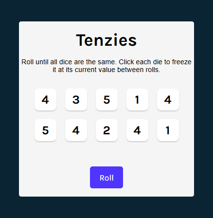
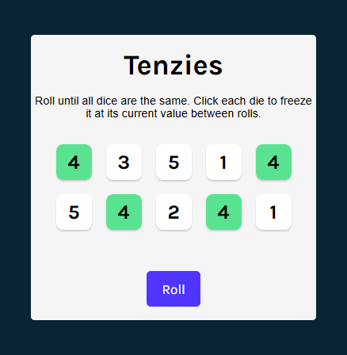
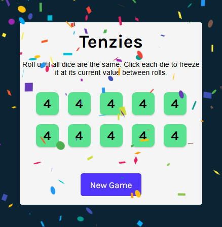

# 🎲 React Tenzies — A Mini Game for Practicing React State and Accessibility

## Description

A fast, responsive mini-game built with React to explore component state, interactivity, and accessibility best practices.
Roll until all dice match — click dice to **hold** their value between rolls and keep going until every die shows the same number.

---

## Tech Stack

**Core**

* React (Vite)
* JavaScript (ES6+)
* CSS3 (Grid & Flexbox)

**Tooling & Libraries**

* ESLint
* nanoid
* react-confetti
* react-use

---

## Live Demo

[**Play React Tenzies on Netlify**](https://ct55-react-tenzies.netlify.app/)

---

## Project Structure

```
src/
├── components/
│   └── Die.jsx
├── assets/
│   ├── docs/
│   │   ├── future-todos.md
│   │   └── pseudocode.md
│   └── shots/
│       ├── scsh-01.png
│       ├── scsh-02.png
│       └── scsh-03.png
├── App.jsx
├── main.jsx
└── index.css
```

---

## Screenshots

| Game Start                                    | Selected Dice                                    | Game Won                                    |
| --------------------------------------------- | ------------------------------------------------ | ------------------------------------------- |
|  |  |  |

---

## Learning Outcomes

Through this project I practiced:

* Managing component state and derived logic in React
* Handling accessibility with `aria-pressed`, `aria-live`, and keyboard focus
* Lazy state initialization and conditional rendering
* Responsive layouts with CSS Grid and Flexbox
* Integrating third-party React libraries for UX polish

---

## Future Improvements

Detailed refactor ideas, accessibility updates, and planned features are documented here:
➡️ [`future-todos.md`](./src/assets/docs/future-todos.md)

These include:

* Extracting game logic into a custom hook
* Adding roll animations and dark mode
* Persisting scores and game state

---

## ⚙️ Getting Started

1. **Clone the repository**

   ```bash
   git clone https://github.com/yourusername/react-tenzies.git
   cd react-tenzies
   ```
2. **Install dependencies**

   ```bash
   npm install
   ```
3. **Run the app locally**

   ```bash
   npm run dev
   ```

---

## Notes for Future Development

> **Note:**
> Keep all dice state in the parent (`App`) to maintain a single source of truth.
> Avoid derived or duplicated state in child components.
> Use **refs** for DOM focus management without triggering re-renders.
> See [future-todos.md](./src/assets/docs/future-todos.md) for more technical notes.


---

## References

* Scrimba Course — [*Learn React*](https://scrimba.com/learn-react-c0e)
* YouTube Tutorial — [Tenzies Game Walkthrough](https://youtu.be/x4rFhThSX04?si=wJI7yJ1cDVi8D7O5)
* Dependencies — [nanoid](https://www.npmjs.com/package/nanoid), [react-confetti](https://github.com/alampros/react-confetti), [react-use](https://github.com/streamich/react-use)

---

## 📅 Project Status

**Completed:** October 2025

**Status:** Functional and stable — future improvements planned

---

### Summary

This project demonstrates React fundamentals, accessibility awareness, and thoughtful UI design — packaged into a clean, self-contained mini-game.
It’s designed as both a **learning project** and a **showcase of professional development practices**.

---


